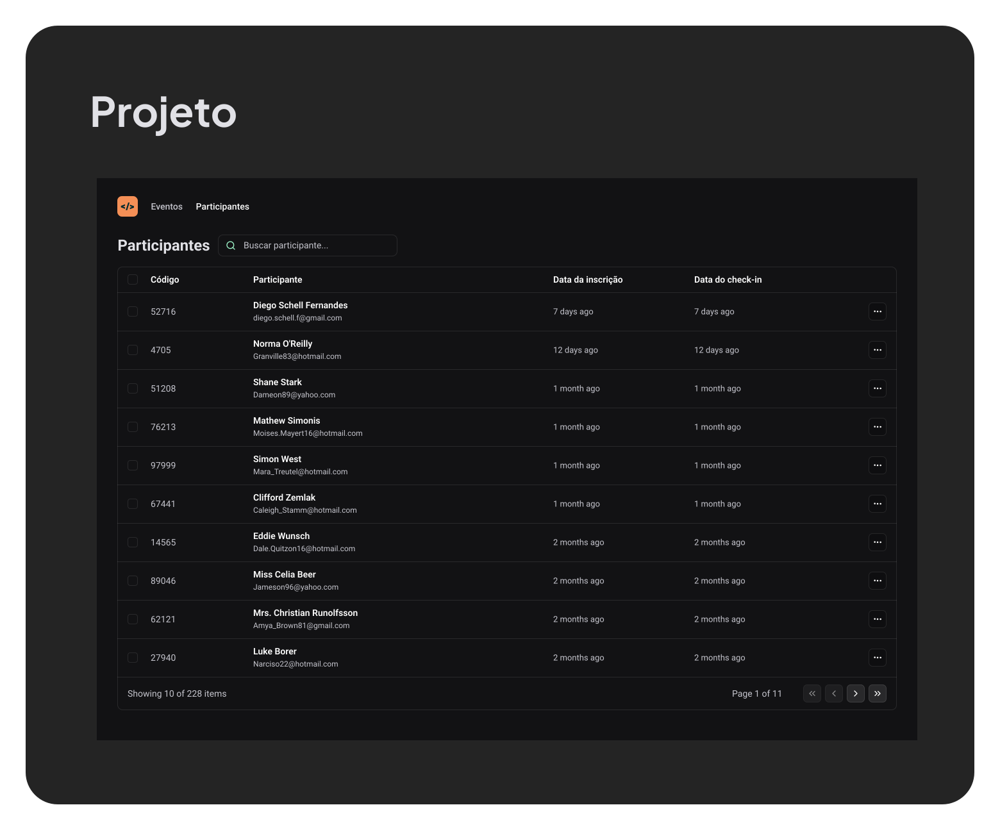
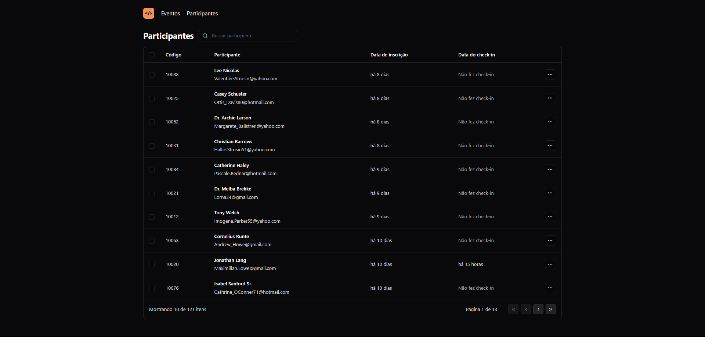

# Aplicação de Gerenciamento de Participantes 



Esta aplicação web permite gerenciar uma lista de participantes de um evento, incluindo a busca por participantes 🔍, paginação 📄 e visualização de detalhes dos participantes 👥.

## Funcionalidades Principais

### 1. Busca de Participantes 🔍

- **Implementação**: A busca de participantes é realizada através de um campo de entrada de texto que permite ao usuário digitar o nome ou e-mail do participante desejado. A busca é realizada em tempo real, atualizando a lista de participantes conforme o usuário digita.
- **Detalhes**: A busca é realizada através de uma requisição GET para a API, passando o termo de busca como parâmetro. A URL da API é configurada para incluir o termo de busca e o índice da página atual.

### 2. Paginação 📄

- **Implementação**: A paginação é implementada para permitir a navegação entre diferentes páginas de participantes. A aplicação exibe um total de participantes e permite ao usuário ir para a primeira, última, próxima ou página anterior.
- **Detalhes**: A paginação é controlada por um estado `page` que é atualizado conforme o usuário navega entre as páginas. A URL da API é configurada para incluir o índice da página atual como parâmetro.

### 3. Visualização de Detalhes dos Participantes 👥

- **Implementação**: A lista de participantes é exibida em uma tabela, mostrando o código do participante, nome, e-mail, data de inscrição e data do check-in. Cada linha da tabela representa um participante.
- **Detalhes**: Os detalhes dos participantes são obtidos através de uma requisição GET para a API, que retorna uma lista de participantes para a página atual. A tabela é atualizada automaticamente quando a lista de participantes é atualizada.

### 4. Check-in dos Participantes 📅

- **Implementação**: A aplicação permite visualizar se um participante fez check-in, mostrando a data do check-in ou uma mensagem indicando que o participante não fez check-in.
- **Detalhes**: A informação de check-in é obtida através dos dados retornados pela API para cada participante.

## Como Usar 🚀

1. **Busca de Participantes**: Digite o nome ou e-mail do participante no campo de busca para filtrar a lista de participantes.
2. **Navegação entre Páginas**: Use os botões de navegação para ir para a primeira, última, próxima ou página anterior.
3. **Visualização de Detalhes**: Clique em um participante para visualizar seus detalhes.

## Instalação das Dependências 🛠️
Primeiro, você precisa instalar todas as dependências necessárias para o projeto. Para isso, execute o seguinte comando no terminal:

```terminal
npm i
```
Verifique a instalação do vite 🌐

```terminal
npm install -g create-vite
```
Iniciar o Projeto 🚀

```terminal
npm run dev
```

## Requisitos 📚

- Node.js
- React
- Axios (para requisições HTTP)
- Day.js (para manipulação de datas)

## Como Integrar com o Backend 🔗



[Link de Acesso ao Repositório](https://github.com/eduardosichelero/Nlw_Unite_Pass_in_Node_Server)

Para rodar o backend do projeto, siga as instruções abaixo.

### Instalação das Dependências 🛠️

Primeiro, você precisa instalar todas as dependências necessárias para o projeto. Para isso, execute o seguinte comando no terminal:

```terminal
npm i
```
### Seed do Banco de Dados 💾

Após a instalação das dependências, é necessário popular o banco de dados com os dados iniciais. Isso pode ser feito utilizando o Prisma para executar o comando de seed. Execute o seguinte comando no terminal:

```terminal
npx prisma db seed
```

### Execução do Projeto 🚀

Por fim, para iniciar o servidor de desenvolvimento e começar a utilizar o backend do projeto, execute o comando:

```terminal
npm run dev
```

Este comando iniciará o servidor em modo de desenvolvimento, permitindo que você faça alterações no código e veja as mudanças em tempo real sem precisar reiniciar o servidor manualmente.

**Lembre-se:**

- Você precisa ter o Node.js e o npm instalados em sua máquina.
- Certifique-se de estar na pasta raiz do projeto antes de executar os comandos.

## Documentação da API (Swagger) 📚

Para documentação da API, acesse o link: [https://nlw-unite-nodejs.onrender.com/docs](https://nlw-unite-nodejs.onrender.com/docs)

### Configuração da Aplicação Web 🔧

Para que a aplicação web possa se integrar corretamente com o backend, é necessário configurar a URL da API no código da aplicação. No exemplo fornecido, a URL da API é configurada para apontar para `http://localhost:3333/events/9e9bd979-9d10-4915-b339-3786b1634f33/attendees`. Certifique-se de que esta URL corresponda à URL do seu servidor de desenvolvimento.

### Testando a Integração 🧪

Após configurar a URL da API e iniciar o servidor de desenvolvimento, você pode testar a integração acessando a aplicação web no navegador e realizando operações como busca de participantes, navegação entre páginas e visualização de detalhes dos participantes.